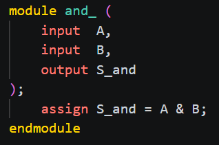
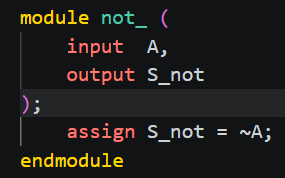
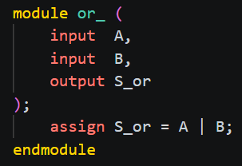
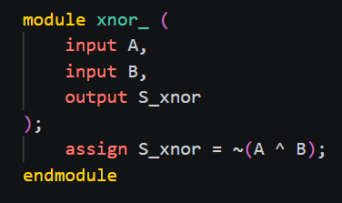
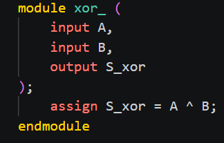
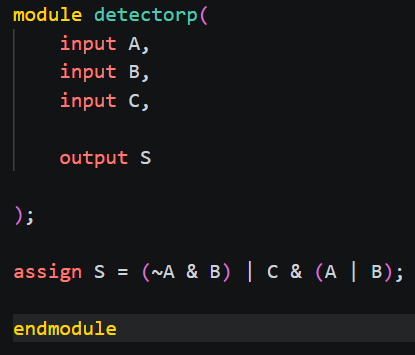
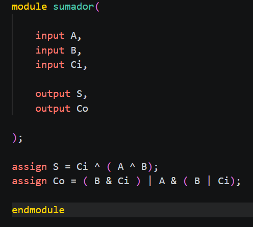
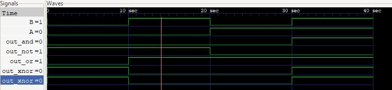
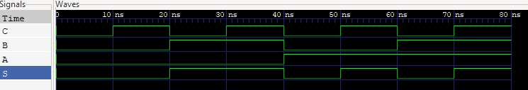
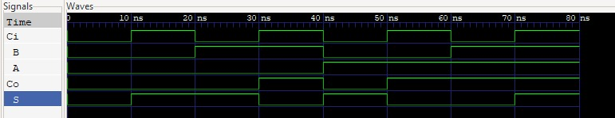

        
# Tecnicas Digitales D3E5

# Descripción
 Este es el repositorio de la asignatura tecnicas digitales.

# Integrantes
* [Gianfranco Lopez Seguin](https://github.com/PeruLover123)
* [Jesus David Leyton Ramirez](https://github.com/RagSource) 
# Informe

Indice:

1. [Compuertas](#Compuertas)
2. [Verificador de numeros primos](#verificador-de-numeros-primos)
3. [Sumador de 1 bit](#sumador-de-1-bit)
4. [Simulaciones](#simulaciones)
5. [Evidencias de implementación](#evidencias-de-implementación)
6. [Conclusiones](#conclusiones)

## Documentación del diseño implementado

## 1. Compuertas

#### 1.1 Descripción

AND: La salida es 1 únicamente cuando A y B son 1.

NOT: Invierte la entrada; si A = 1, la salida es 0, y viceversa.

OR: La salida es 1 cuando al menos una de las entradas (A o B) es 1.

XNOR: La salida es 1 cuando A y B son iguales.

XOR: La salida es 1 cuando A y B son diferentes.

#### 1.2 Diagramas

## 2. Verificador de Numeros Primos

#### 2.1 Descripción

Detector de números primos: Circuito lógico combinacional de 3 entradas (A, B y C) que representa un número en código binario. Cada entrada tiene un peso según su posición: A = 2², B = 2¹ y C = 2⁰. Por lo tanto, el número decimal se obtiene mediante la suma A·2² + B·2¹ + C·2⁰. El circuito evalúa esta combinación y activa la salida S = 1 cuando el valor obtenido corresponde a un número primo.

Ejemplo: si A=1, B=0, C=1 → 1·4 + 0·2 + 1·1 = 5, y como 5 es primo, entonces S = 1.

#### 2.2 Diagramas

## 3. Sumador de 1 bit

#### 3.1 Descripción

Sumador de 1 bit: Circuito lógico combinacional que suma dos bits de entrada (A y B) junto con un acarreo de entrada (Ci). Genera dos salidas: S, que representa el bit de suma, y Co, que representa el acarreo de salida hacia la siguiente posición.

#### 3.2 Diagramas

## Simulaciones

### 1. Simulacion de compuertas

### 2. Simuacion de verificador de Numeros Primos

### 3. Simulacion de Sumador de 1 bit

## Evidencias de implementación

https://youtu.be/5Vqt8NWnJk8 

## Conclusiones

En este trabajo se logró comprender el funcionamiento de las compuertas lógicas y los circuitos combinacionales, implementándolos mediante Verilog en Quartus. Además, se pudo comprobar su funcionamiento utilizando una FPGA, relacionando los conceptos de lógica digital con una implementación práctica. Esto permitió reforzar los conocimientos sobre el diseño y programación de circuitos digitales.
