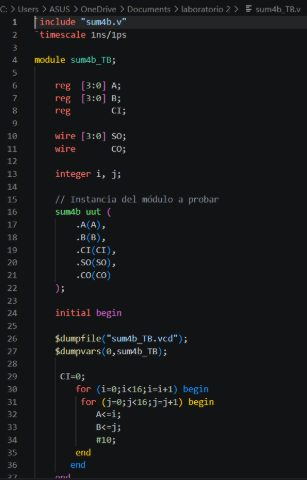
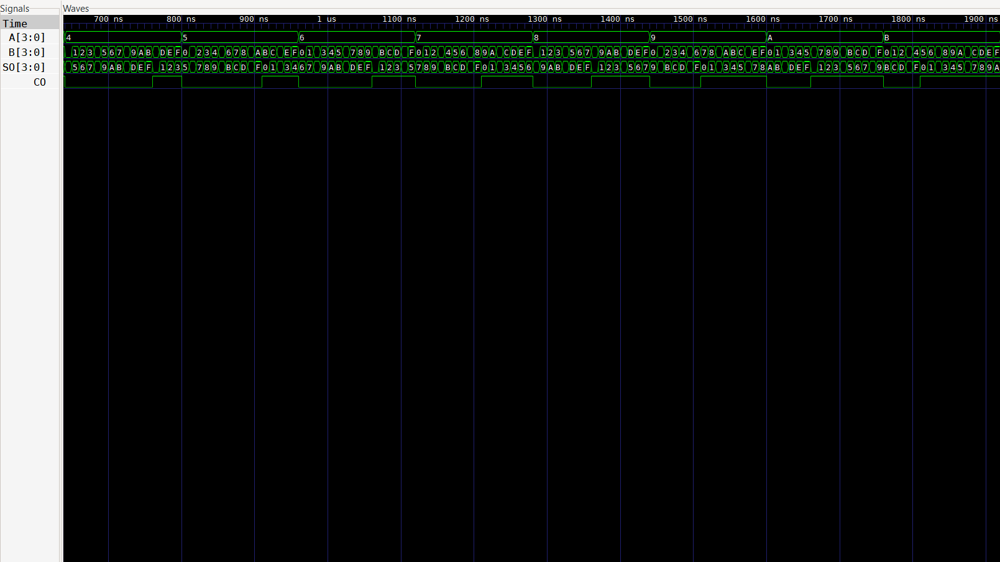

        
# Tecnicas Digitales D3E5

# Descripción
 Este es el repositorio de la asignatura tecnicas digitales.

# Integrantes
* [Gianfranco Lopez Seguin](https://github.com/PeruLover123)
* [Jesus David Leyton Ramirez](https://github.com/RagSource)
  
# Informe

Indice:

1. [Sumador de 4 bit](#sumador-de-4-bit)
2. [Simulaciones](#simulaciones)
3. [Evidencias de implementación](#evidencias-de-implementación)
4. [Conclusiones](#conclusiones)

## Documentación del diseño implementado

## 1. Sumador de 4 bit

#### 1.1 Descripción

El código mostrado corresponde a un sumador binario de 4 bits, diseñado en Verilog. Su función es realizar la suma de dos números binarios de 4 bits, A y B, y producir como resultado una salida de 4 bits SO junto con un bit de acarreo CO.

El módulo principal que se está probando es sum4b, al cual se conectan:

A[3:0]: primer número binario de 4 bits.

B[3:0]: segundo número binario de 4 bits.

CI: acarreo de entrada.

SO[3:0]: resultado de la suma.

CO: acarreo de salida.

El código de prueba (sum4b_TB) utiliza dos ciclos for para recorrer automáticamente todas las combinaciones posibles de A y B, desde 0000 hasta 1111. Después de asignar cada combinación, se espera 10 ns mediante #10, permitiendo verificar el comportamiento del sumador.

#### 1.2 Diagramas

## Simulaciones

### 1. Simulacion de Sumador de 4 bit

## Evidencias de implementación

[https://youtu.be/5Vqt8NWnJk8 ](https://youtube.com/shorts/JHm4cgv1i4k?feature=share)

## Conclusiones

En conclusión, se logró comprender el funcionamiento de un sumador de 4 bits y su implementación en Verilog. A través de la simulación se comprobó que el circuito realiza correctamente la suma de los valores de entrada y genera el acarreo correspondiente cuando es necesario. También se pudo observar cómo el testbench permite probar diferentes combinaciones de manera automática y verificar el comportamiento del circuito. Con esta práctica se reforzaron los conocimientos sobre suma binaria, circuitos digitales y simulación en Verilog.
